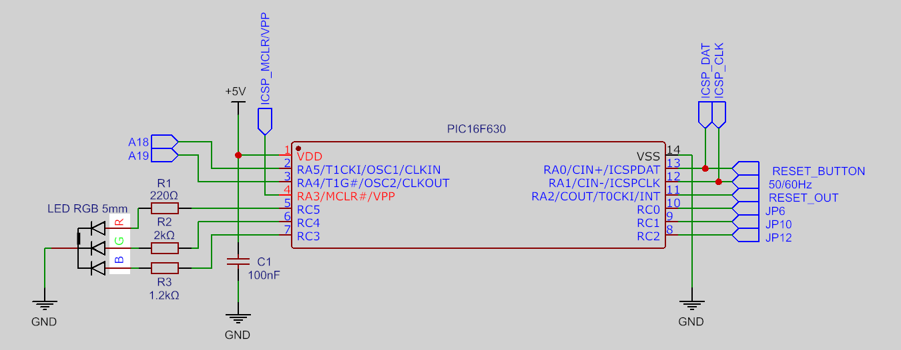
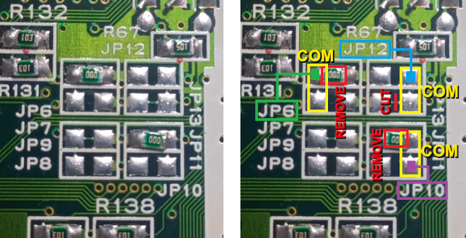
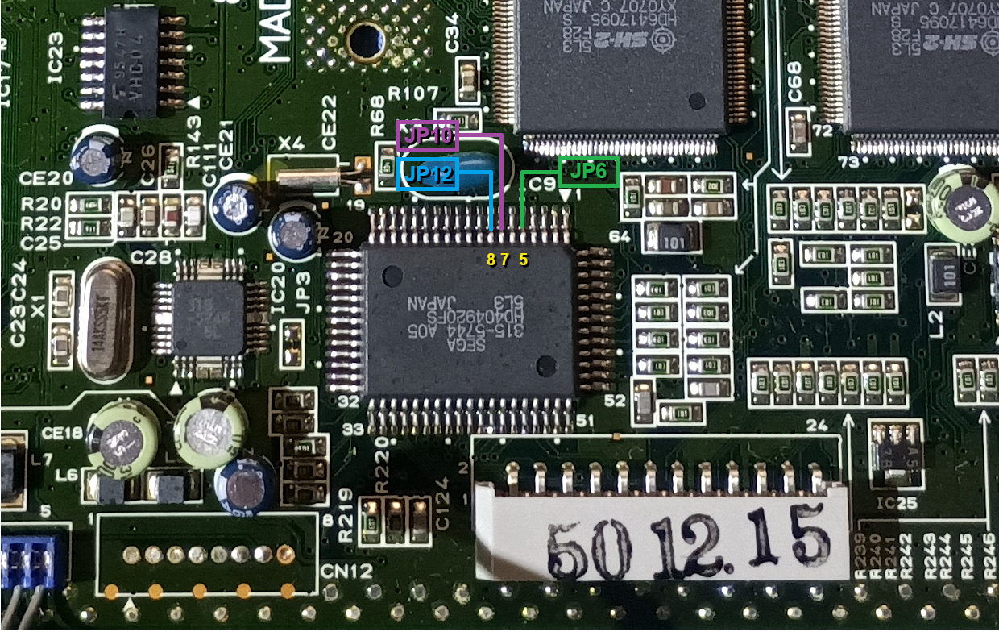
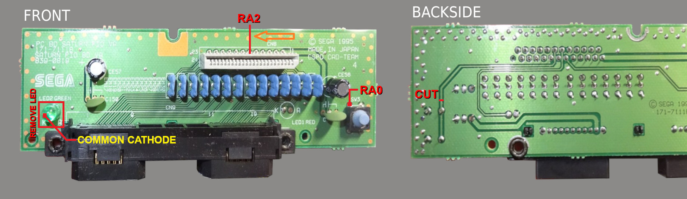
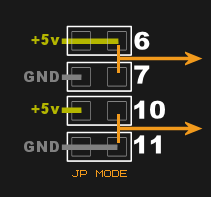
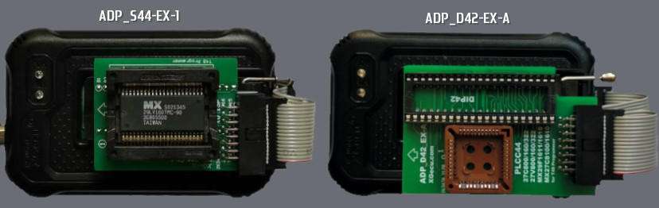
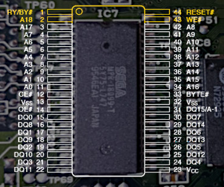
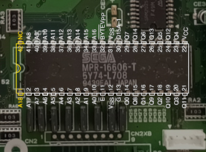
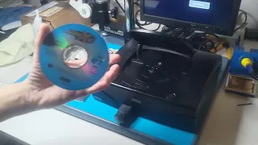
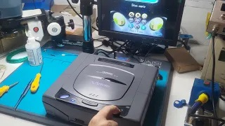

<a name="top"></a>

# Saturn Smart Reset Button

[](LICENSE)
[](../../releases)
[](../../releases)
[](https://youtu.be/afSKgW2aVuQ) 
&nbsp;&nbsp;&nbsp;
<span>
[](docs/README.pt-BR.md)[](docs/README.pt-BR.md)
</span>

SAT-SRB is a switchless mod for the Sega Saturn, expanding region selection with multi-BIOS bankswitching and RGB LED feedback. Originally based on the  [**Saturn Switchless Mod**](https://github.com/sebknzl/saturnmod) (2004), this version introduces full BIOS bankswitching support for reprogrammable ICs and enhances visual feedback with an RGB LED, while being entirely rewritten for the XC8 compiler. 

## Table of Contents
- [Get Started](#get-started)
- [Building & Flashing](#building--flashing)
- [Installation Notes](#installation-notes)
- [Saturn Mainboard Considerations](#saturn-mainboard-considerations)
- [BIOS Bankswitch Mapping](#bios-bankswitch-mapping)
- [Preparing BIOS Images](#preparing-bios-images-byte-swapping-and-merging)
- [Flashing BIOS](#flashing-bios-to-ic-programmers-and-adapters)
- [BIOS Installation](#bios-physical-installation)
- [Demonstration Videos](#demonstration-videos)
- [Troubleshooting & Diagnostics](#troubleshooting--diagnostics)
- [FAQ](#-faq---frequently-asked-questions)
- [About this Guide](#about-this-guide)

---

## Overview

### Features

- ✅ Switchless region selector (Japan/North America/Europe)
- ✅ Reset button control (Short/Medium/Long press)
- ✅ Supports dual/multi-BIOS replacement using reprogrammable memory
- ✅ Manage up to 4 BIOS banks (Address-selected by the PIC)
- ✅ RGB LED feedback (Common cathode)
- ✅ LED colors and BIOS type fully configurable via `#define` macros
- ✅ 50Hz / 60Hz vertical frequency toggle
- ✅ EEPROM save for last selected bank → region
- ✅ Works on all Sega Saturn boards

### RGB LED Support

<details>
<summary> 🔴🟢🔵 LED color assignment for region/BIOS presets can be customized - Click to expand</summary>

```c
// ** LED COLOR ASSIGNMENT **
#define COLOR_JAP   LED_BLUE
#define COLOR_USA   LED_GREEN
#define COLOR_JAP2  LED_CYAN
#define COLOR_EUR   LED_YELLOW
#define COLOR_JAP3  LED_PURPLE
```
</details>

### Bankswitching Support for Dual/Multi-BIOS Upgrade  

This mod supports the following reprogrammable ICs for multi-bank BIOS replacement:

- 29F800 (SOP44, 8Mbit, 2 banks)
- 29F1610 (SOP44, 16Mbit, 4 banks)
- 27C800 (DIP42, 8Mbit, 2 banks)
- 27C160 (DIP42, 16Mbit, 4 banks)

<details>
<summary> ℹ️ The BIOS chip size is predefined in code and can be changed if needed - Click to expand</summary>
  
```c
// ** SELECT BIOS IC **
#define BIOS    IC_8M   // IC_16M (4 banks) | IC_8M (2 banks)
```
</details>
  
> [!NOTE] 
> Bankswitching is an optional feature.  
> If you're using the original onboard BIOS or replacing it with a single Region-Free image, set `IC_8M`.  
> In this case, the PIC's bankswitch lines are not required.

### Button Usage

| Action                  | Description                       |
|------------------------|-----------------------------------|
| Short press (<250ms)   | Perform RESET                     |
| Medium press (<1250ms) | Vertical frequency toggle 50Hz/60Hz|
| Long press (>1250ms)   | Cycle through region/BIOS presets|

> [!TIP]
> LED will flash to indicate 50Hz (slow) or 60Hz (fast)

---

## Get Started

> [!IMPORTANT]  
> This quickstart outlines essential installation steps. For full guidance, refer to the detailed sections below.

### Required Materials for basic deployment

- ✅ PIC16F630 or PIC16F676 with preloaded `.hex`
- ✅ RGB LED (common cathode) + resistors: 🔴 220Ω 🟢 2kΩ 🔵 1.2kΩ
- ✅ Soldering tools: fine-tip iron, solder, multimeter
- ✅ 30 AWG wire-wrap
- ✅ Precision blade or box cutter for cutting PCB traces

### Required Materials for bankswitch deployment

- ✅ Reprogrammable IC correctly preloaded with BIOS banks
- ✅ Hot air rework station for SOP40 BIOS, or desoldering station/suction pump for DIP40 BIOS

---

### Quick Steps

| Step | Description                                                             | Applies to              |
|------|-------------------------------------------------------------------------|-------------------------|
| 1️⃣   | Cut fixed traces for region, frequency and reset lines                 | Basic & Bankswitch      |
| 2️⃣   | Connect PIC: power, LED lines, reset, region and frequency signals     | Basic & Bankswitch      |
| 3️⃣   | Power up and verify boot, LED, region/BIOS cycling, reset and video mode switching | Basic & Bankswitch      |
| 4️⃣   | Prepare BIOS: byte-swap → concatenate (`copy /b`) → flash to EEPROM    | Bankswitch only         |
| 5️⃣   | Remove original IC7 using hot air (SOP) or suction (DIP)               | Bankswitch only         |
| 6️⃣   | Connect PIC: A18 and/or A19 lines                                      | Bankswitch only         |

> [!NOTE]
> Schematic preview - Click to enlarge  
> <a href="img/Schematic_SAT-SRB.png">
>   
> </a><br>
>  Go to [Installation Notes](#installation-notes) for wiring and connection details.

---

### ✅ Preflight Checklist

- [ ] If using region/VF lines, ensure DIP switches are fully compliant (see details in following sections)
- [ ] If BIOS is replaced, chip must be correctly aligned and soldered
- [ ] Control wires are double-checked
- [ ] PIC is powered and LED is lit
- [ ] Console displays Sega Saturn logo when powered on
- [ ] RESET button cycles BIOS and 50/60Hz toggle correctly
- [ ] LED colors change across region presets
- [ ] Console boots successfully in each region/BIOS

> [!TIP]  
> The next sections such as [Installation Notes](#installation-notes), [BIOS Installation](#bios-physical-installation), and [Troubleshooting & Diagnostics](#troubleshooting--diagnostics) guide you through each wiring step with diagrams and checks to avoid common issues.

[🔝 Back to top](#top)

---

## Building & Flashing

### Source Code (Optional Compilation)
To build from source:
- Use [MPLAB X IDE](https://www.microchip.com/en-us/tools-resources/develop/mplab-x-ide) and [XC8 Compiler](https://www.microchip.com/en-us/tools-resources/develop/mplab-xc-compilers)
- Target microcontroller: **PIC16F630** or **PIC16F676**
- Clock: `4MHz` internal
- `MCLR` disabled (set as input)

### ⚡ Precompiled `.hex`
For convenience, a precompiled **`.hex` file** is included in the [Releases](../../releases) section.  
This allows quick flashing using:

- **MPLAB IPE 6.20 or newer**
- **PICKit 3** or compatible programmer

No source compilation is required if using the `.hex`.

[🔝 Back to top](#top)

---

## Installation Notes

- Designed for all Sega Saturn mainboards:
  - VA0, VA1, VA SD, VA SG, VA9, VA13
- DIP switch assignment via RC0–RC2 (JP6, JP10, JP12) -> **Only effective if using standard BIOS**
- RGB LED used in this project is a **high-brightness** type (common cathode).  
  -  Recommended resistor values:  
    🔴 Red = **220Ω**, 🟢 Green = **2kΩ**, 🔵 Blue = **1.2kΩ**  
> [!TIP]
> If using **diffused or opaque LEDs**, resistor values can be reduced accordingly to achieve the desired brightness.

### PIC16F630 / PIC16F676 Pinout

| Pin | Name | Function                        |
|-----|------|---------------------------------|
| 1   | VCC  | +5V Power Supply                |
| 2   | RA5  | A18 BIOS Bankswitch             |
| 3   | RA4  | A19 BIOS Bankswitch (16M only)  |
| 4   | RA3  | ICSP MCLR / VPP                 |
| 5   | RC5  | Red LED (Anode)                 |
| 6   | RC4  | Green LED (Anode)               |
| 7   | RC3  | Blue LED (Anode)                |
| 8   | RC2  | JP12 Region DIP Switch          |
| 9   | RC1  | JP10 Region DIP Switch          |
| 10  | RC0  | JP6 Region DIP Switch           |
| 11  | RA2  | RESET OUT to console            |
| 12  | RA1  | 50/60Hz VF Toggle / ICSP CLK    |
| 13  | RA0  | Reset Button Input / ICSP DAT   |
| 14  | VSS  | Ground                          |

> [!TIP]
> The full schematic is referenced in the [Quick Steps](#quick-steps) section for installation guidance.

### DIP Switch Layout Reference

#### Region Mapping

| Region            | JP6  | JP10 | JP12 |
|-------------------|------|------|------|
| Japan (JP)        | 1    | 0    | 0    |
| North America (NA)| 0    | 1    | 0    |
| Europe (EU)       | 0    | 1    | 1    |

> [!IMPORTANT] 
> Consoles with a **Region-Free BIOS** do not require DIP switch signal control, and may remain in their original state.  
> For the **original BIOS** or standard dumps, the PIC must control JP6, JP10, and JP12, and these lines must be properly connected.

The image below illustrates the typical layout of the region DIP switch pairs on Sega Saturn mainboards preconfigured to the Japan region, along with important modification points:



- **Yellow highlights** indicate the **common terminals** pairs that are used for region detection by the system.
- **Red highlights** mark **0Ω resistors** or **permanent traces** that must be **removed or cut** to safely use the DIP signals with the PIC microcontroller.
- **Green line** represents the signal line connected to **JP6**
- **Purple line** represents the signal line connected to **JP10**
- **Blue line** represents the signal line connected to **JP12**

### Region Signal Connection via IC9 (315-5744)

All Saturn mainboard revisions include an IC labeled **315-5744** (IC9), which interfaces with the region DIP switches (JP6, JP10, JP12).  
This IC is located on the **top side** of the board and offers convenient access points for connecting the PIC to region signals, especially when some DIP switches are located on the **bottom side**, depending on the board revision.

The image below shows the relevant pins of IC9 used to access the region lines:



- **Pin 5** (green): Region line connected to **JP6**
- **Pin 7** (purple): Region line connected to **JP10**
- **Pin 8** (blue): Region line connected to **JP12**

Examples:
- On **VA-SG boards**, all region DIP switches are on the bottom side, making IC9 the preferred connection point for all signals.
- On **VA-SD boards**, only **JP6** is on the bottom side, so **pin 5 of IC9** can be used for **RC0**, while **JP10** and **JP12** remain easily accessible from the top for **RC1** and **RC2**, respectively.  

> [!WARNING]
> Connecting to IC9 only affects signal routing.  
> The DIP switch pads must still be properly prepared. Any fixed connections to VCC or GND must be removed as described.

### Control Board Wiring (Button & LED)

Some connections must be routed to the **front control board**, where the RESET button and original green power LED are located.  
The reference picture below shows both sides of the board, one trace cut, and solder points:  



- **LED replacement:**  
  Remove the original green LED and use its **via (K)** to connect the common cathode terminal of your **RGB LED** (typically the larger leg).  
  Make sure the original **via (A)** on the control board is **properly isolated**, so it does not make contact with any terminal of the RGB LED.

- **RESET/Cycle button:**  
  On the **back side** of the board, cut the trace marked in red (see photo).  
  On the **front side**, solder the wire from **pin 13 (RA0)** of the PIC to the terminal labeled **RA0** (as shown in the photo). This allows RESET/Cycle functionality to be driven by the mod.

- **Console RESET signal:**  
  Solder the wire from **pin 11 (RA2)** of the PIC to the **11th pin of connector CN8**, at the position labeled **RA2** in the photo.  
  (Looking top-down, this is the **sixth pin** from right to left.)

Make sure trace cuts and wire routing follow the reference photo to avoid electrical conflicts or missed signals.  

[🔝 Back to top](#top)

---

## Saturn Mainboard Considerations

All Saturn mainboard revisions include **fixed traces** connecting DIP switch pairs to either **GND** or **VCC**.  
The exact placement of these connections may vary depending on the **board revision** and **console region**, and they are typically implemented using **direct PCB traces** or **0Ω resistors**.

These fixed links can exist on **either side** of a DIP switch pair and must be carefully **identified and removed** before connecting the corresponding signal to the **PIC**.

For example:
- A common case is **JP13** being permanently tied to GND when **JP12** is unused
- On some boards, **R29** replaces **JP2** as the GND-side of the frequency selector pair

Each DIP switch has a corresponding paired terminal:

- **JP6 ↔ JP7**
- **JP10 ↔ JP11**
- **JP12 ↔ JP13**
- **JP1 ↔ JP2** (or **R29**, depending on board revision)

> [!NOTE] 
> JP8–JP9 also form a physical pair, but they are not involved in user-facing region settings and do not need to be touched.  

These pairs are wired such that:
- One side (e.g. JP6, JP10, JP12, JP1) typically routes to **VCC**
- The paired side (e.g. JP7, JP11, JP13, JP2/R29) routes to **GND**

These are implemented as matched pairs and must be carefully verified on each mainboard revision before use.

> [!CAUTION]
> Only one terminal of each pair should ever be active.
 
For example, if **JP6** is used to connect to VCC, then **JP7** (its pair) must remain **disconnected**.  
The same rule applies for all DIP switch pairs: **Both sides must never be active simultaneously**.



### ⚠️ Important Warning

Before connecting any DIP switch signal to the PIC:

> [!WARNING]
> The common terminal of each DIP switch pair must be fully disconnected from any fixed VCC or GND source.  
> This ensures the PIC can safely drive the line HIGH or LOW as needed.  
> If the PIC drives a signal while the other side is hardwired, it will result in a **severe signal conflict** between logic levels.

- ✅ Remove any **0Ω resistors** or **traces** that may force a fixed logic level.
- ✅ Ensure that **both sides of each DIP switch pair** are **not physically connected** to either **VCC or GND**.
- ✅ Confirm with a **multimeter** that the common terminal is electrically isolated from power and ground.

> [!CAUTION]
> Failing to isolate the DIP signal lines properly can cause **permanent damage** to the Sega Saturn mainboard and/or the PIC MCU.  
> Always verify the electrical state of each DIP switch pair before enabling region or frequency control via DIP switches.  

[🔝 Back to top](#top)

---

## BIOS Bankswitch Mapping

To support multiple BIOS variants, the system allows mapping specific images to each bank:

### Bank Map for 8Mbit (2 x 512KB banks)

| Region | Bank | A18 | 
|--------|------|-----| 
| JP    | 0    | LO  | 
| NA    | 1 🔁 | HI  | 
| EU    | 1 🔁 | HI  | 

### Bank Map for 16Mbit (4 x 512KB banks)

| Region   | Bank | A19 | A18 | 
|----------|------|-----|-----| 
| JP(1)    | 0    | LO  | LO  | 
| NA       | 1 🔁 | LO  | HI  |
| JP(2)    | 2    | HI  | LO  | 
| EU       | 1 🔁 | LO  | HI  | 
| JP(3)    | 3    | HI  | HI  | 

> 🔁 Same bank shared by NA / EU

### Supported BIOS examples:
These BIOS images are 512KB each and suitable for use in 8Mbit or 16Mbit chips divided into 512KB (4Mbit) banks:  

- **JP(1):** Sega Saturn (Sega)
- **JP(2):** V-Saturn (Victor)
- **JP(3):** Hi-Saturn (Hitachi)
- **NA/EU:** Sega Saturn - World-Wide (Sega)

> [!IMPORTANT] 
> The mod works with console’s **original BIOS** (IC7), a standard BIOS dump or a **Region-Free BIOS**.  
> When using the original BIOS or a standard dump, the PIC must drive the region lines (JP6, JP10, JP12), which should be properly routed to their corresponding pads on the mainboard.

> [!TIP]
> **Only Region-Free BIOS versions bypass the region lines requirement**.  

[🔝 Back to top](#top)

---

## Preparing BIOS Images (Byte-Swapping and Merging)

1. **Endianness:**  
   BIOS binaries must be in **big-endian** format (byte-swapped).  
   This matches the 68000-based architecture of the Saturn.

> ℹ️ Most BIOS dumps are in little-endian and must be byte-swapped before merging.

You can inspect BIOS byte order using a hex editor such as [HxD](https://mh-nexus.de/en/hxd/), or through programmer software like **XGPro (XGecu Pro)** with the **T48 (TL866-3G)** EEPROM programmer, which provides an option for **byte-swapping**.

<details>
<summary>BIOS dump example: little-endian vs big-endian - Click to expand</summary>

### Example: BIOS header region (addresses 0x9C0–0x9FF)

**Little-endian view (raw dump):**

    000009C0  43 4F 50 59 52 49 47 48 54 28 43 29 20 53 45 47  COPYRIGHT(C) SEG
    000009D0  41 20 45 4E 54 45 52 50 52 49 53 45 53 2C 4C 54  A ENTERPRISES,LT
    000009E0  44 2E 20 31 39 39 34 20 41 4C 4C 20 52 49 47 48  D. 1994 ALL RIGH
    000009F0  54 53 20 52 45 53 45 52 56 45 44 20 20 20 20 20  TS RESERVED     

**Big-endian (byte-swapped, correct for 68000 systems):**

    000009C0  4F 43 59 50 49 52 48 47 28 54 29 43 53 20 47 45  OCYPIRHG(T)CS GE
    000009D0  20 41 4E 45 45 54 50 52 49 52 45 53 2C 53 54 4C   ANEETPRIRE,S STL
    000009E0  2E 44 31 20 39 39 20 34 4C 41 20 4C 49 52 48 47  .D1 99 4LA LIRHG
    000009F0  53 54 52 20 53 45 52 45 45 56 44 20 20 20 20 20  STR SEREEV D      

</details>

> [!NOTE] 
> Use tools or scripts that swap bytes **pairwise (16-bit)** to convert from little- to big-endian format.  

> [!TIP]
> A useful third-party command-line utility is [`SwapEndian.exe`](https://raw.githubusercontent.com/Electroanalog/SAT-SRB/main/util/SwapEndian.zip), included in this repository.  
> Usage: `SwapEndian <filename>`  

2. **Combining BIOS Images:**  
   Concatenate the BIOS files according to memory bank order:

   **For 8Mbit IC (2 banks, 1024KB):**
   ```cmd
   copy /b JAP.BIN + USA.BIN 29F800.BIN
   ```

   **For 16Mbit IC (4 banks, 2048KB):**
   ```cmd
   copy /b JAP.BIN + USA.BIN + JAP2.BIN + JAP3.BIN 29F1610.BIN
   ```
<details>
<summary>ℹ️ BIOS address map inside the final merged binary - Click to expand</summary>
<br>

> | Bank | Address Range       | Size     | Chip Capacity     | Supported ICs                    |
> |------|---------------------|----------|-------------------|----------------------------------|
> | 0    | 0x000000 – 0x07FFFF | 512 KB   | 8Mbit / 16Mbit    | 29F800, 27C800 / 29F1610, 27C160 |
> | 1    | 0x080000 – 0x0FFFFF | 512 KB   | 8Mbit / 16Mbit    | 29F800, 27C800 / 29F1610, 27C160 |
> | 2    | 0x100000 – 0x17FFFF | 512 KB   | 16Mbit            | 29F1610, 27C160                  |
> | 3    | 0x180000 – 0x1FFFFF | 512 KB   | 16Mbit            | 29F1610, 27C160                  |
</details>
<br>

[🔝 Back to top](#top)

---

## Flashing BIOS to IC (Programmers and Adapters)  
> [!IMPORTANT]
> Ensure the merged binary (e.g., `29F800.BIN`) is **byte-swapped** before flashing.

3. **Flashing:**  
   Use a **T48 (TL866-3G)** programmer with:

   - **ADP_S44-EX-1** SOP44 adapter for 29F800 and 29F1610  
   - **ADP_D42-EX-A** DIP42 adapter for 27C800 and 27C160
  
     
   
   Or use any other programmer capable of writing to these ICs in their respective packages.

---

## BIOS Physical installation:  

> [!WARNING]
> The flash chips used in this mod (**29F800** and **29F1610**) use a **SOP44 package**, while the original Sega Saturn Mask ROM (IC7) comes in a **SOP40 package**.  
> Therefore, when installing the flash IC onto the board, correct alignment and pin handling is critical.

### BIOS IC7 alignment on the board (SOP44)

- Align pin **3** (A17) and **42** (A8) of the EEPROM to match the location of pins **1** (A17) and **40** (A8) of the original SOP40 Mask ROM (IC7).
- This places pins **1–2** and **43–44** of the flash IC **outside** the footprint of the original ROM and must be **lifted** (not soldered to the board).
- The original SOP40 Mask ROM must be **desoldered using a hot air rework station**. This tool is **essential** for safe removal without damaging the board.

  

### Wiring for lifted pins:

#### For **29F800**:
- Pin **1** (RY/BY#): **Not connected** or **VSS (GND)**
- Pin **2** (A18): Connect to **RA5 (Pin 2)** on the PIC
- Pin **43** (WE#): Connect to **VCC (+5V)**
- Pin **44** (RESET#): Connect to **VCC (+5V)**

#### For **29F1610**:
- Pin **1** (WE#): Connect to **VCC (+5V)**
- Pin **2** (A18): Connect to **RA5 (Pin 2)** on the PIC
- Pin **43** (A19): Connect to **RA4 (Pin 3)** on the PIC
- Pin **44** (WP#): Connect to **VSS (GND)**
---

> [!WARNING]
> In the VA0 revision of the Sega Saturn, the original Mask ROM (IC7) comes in a **DIP40 package**.  
> In this case, the replacement BIOS must use a compatible **DIP42 package**, such as the **27C800** (8Mbit) or **27C160** (16Mbit) UV EPROM.  
> Correct alignment and pin handling is critical.

### BIOS IC7 alignment on the board (DIP42)

- Align pin **2** (A17) and **41** (A8) of the EPROM to match the location of pins **1** (A17) and **40** (A8) of the original DIP40 Mask ROM (IC7).
- Although the board includes holes for DIP42, they serve different functions, and pins **1** and **42** of the EPROM **must be lifted**.
- The original DIP40 Mask ROM must be **removed using a desoldering station** (suction type). This tool is **highly recommended** to avoid pad damage.
- It's also a good idea to install a **DIP40 socket** after removal, to make testing and replacement easier.

  

### Wiring for lifted pins:

#### For **27C800**:
- Pin **1** (A18): Connect to **RA5 (Pin 2)** on the PIC
- Pin **42** (NC): **Not connected** 

#### For **27C160**:
- Pin **1** (A18): Connect to **RA5 (Pin 2)** on the PIC  
- Pin **42** (A19): Connect to **RA4 (Pin 3)** on the PIC

[🔝 Back to top](#top)

---

## Demonstration Videos

Example of the mod in action, showing normal operation and behavior once correctly installed.

▶ Sega Saturn with SRB dual-bank BIOS:  
[](https://youtu.be/afSKgW2aVuQ)  

▶ V-Saturn with SRB multi-bank BIOS:  
[](https://youtu.be/ilHhgGw1XoA)  

[🔝 Back to top](#top)

---

## Troubleshooting & Diagnostics

| Issue                                  | Details                                                                                                                                                   |
|----------------------------------------|-----------------------------------------------------------------------------------------------------------------------------------------------------------|
| **Mod not responding after installation** | **Possible causes:**<br>- No power supplied to the PIC (check VCC and GND on pins 1 and 14).<br>- Firmware not compiled correctly or flashed to wrong MCU. |
| **RESET button does not change region or frequency** | **Check for:**<br>- Press timing:<br>  • Short (<250 ms): RESET<br>  • Medium (<1250 ms): Frequency toggle<br>  • Long (>1250 ms): Region/BIOS cycle<br>- Ensure RESET lines are properly connected:<br>  •**RA0** ↔ button input<br>  •**RA2** ↔ RESET output to console |
| **RGB LED not lighting up or wrong colors** | **Common causes:**<br>- Resistor values not optimized for LED brightness:<br> 🔴 Red = 220 Ω; 🟢 Green = 2 kΩ; 🔵 Blue = 1.2 kΩ  *(for high-brightness LEDs)*<br>- For **diffused or lower-brightness LEDs**, use **lower resistor values** to improve visibility.<br>- Incorrect LED type: Must be **common cathode**. |
| **Image appears in black & white or stretched** | **Check for:**<br>- Medium press (<1250 ms) of RESET button toggles between 50Hz and 60Hz video modes.<br>- Verify that **RA1** (VF toggle output) is connected to the **common terminal of JP1** <br>- Ensure the JP1-JP2(or R29) pair is properly prepared. Both sides must be disconnected from fixed VCC or GND to allow signal control by the PIC. |
| **Console fails to boot or shows black screen** | **Possible reasons:**<br>- BIOS not byte-swapped to **big-endian** before merging/flashing.<br>- Flash chip misaligned: Verify correct pinout adaptation, especially for lifted pins (A18/A19, WE#, RESET#).<br>- Poor solder joints: Check that all flash pins are fully soldered and there are no bridges between adjacent pads.<br>- **A18** and **A19** lines not properly connected from the PIC to the corresponding BIOS pins. |
| **BIOS animation never changes when cycling** | **Check for:**<br>- Whether only one BIOS bank was flashed (other banks left blank or filled with the same image).<br>- If **A18** and **A19** lines are hardwired to VCC or GND. They must remain under PIC control. |

[🔝 Back to top](#top)

---

## ❔ FAQ - Frequently Asked Questions

<details>
<summary>Do I need to byte-swap the BIOS files?</summary>

*Yes. All BIOS images must be converted to **big-endian** format before merging or flashing.  
Most raw dumps found online are in **little-endian**, and must be byte-swapped to ensure compatibility with the Saturn’s 68000-based architecture.*
</details>


<details>
<summary>Can I use a single Region-Free BIOS image?</summary>

*Yes. Region-Free BIOS images work without PIC control over **JP6**, **JP10**, and **JP12**.  
If **all BIOS banks** contain Region-Free images, those jumper lines can be **left unconnected**, and region selection via long press will have no effect but BIOS switching will still work as expected.*
</details>

<details>
<summary>Do I need to use all BIOS banks?</summary>

*No. The mod supports different usage modes:*
- ***Original BIOS (no switching):**  
  Define `#define BIOS IC_8M` and leave **A18** and **A19** unconnected.  
  In this mode, the mod cycles through 3 region presets (JP → NA → EU ↺) using long RESET presses.  
  To enable this functionality, the region selection lines (JP6, JP10, JP12) must be properly wired to the PIC. If these lines are not connected, region cycling will have no effect.*
- ***2-bank mode (8Mbit flash):***  
  *Define `IC_8M` and connect **A18**.*  
  *The PIC will alternate between 2 BIOS banks across 3 regions presets.*
- ***4-bank mode (16Mbit flash):***  
  *Define `IC_16M` and connect both **A18** and **A19**.*  
  *This enables cycling through 5 presets (JP → NA → JAP2 → EU → JAP3 ↺) with full multi-BIOS support.  
  The additional cycles are intended to accommodate BIOS variants specific to Japan-only models, such as V-Saturn and Hi-Saturn.  
  Use `IC_16M` only if all 4 banks are properly populated, otherwise, select `IC_8M` to avoid cycling into unused positions.*
</details>

<details>
<summary>Do region dipswitches have any effect with Region-Free BIOS?</summary>

*No. Region-Free BIOS images ignore the region lines (JP6, JP10, JP12) and always allow the console to boot **any game disc**, regardless of its region.  
You can still install multiple Region-Free BIOS variants (e.g. Sega, V-Saturn, Hi-Saturn) and switch between them with long RESET presses even if the region lines are not connected.*
</details>

<details>
<summary>What happens if I don't remove the factory region/frequency jumpers?</summary>

*If dipswitches (e.g. JP6, JP10, JP12, JP1–JP2/R29) have their common terminals internally linked to fixed **VCC or GND**, connecting them to the PIC may result in **electrical conflict** when it attempts to drive those signals.*
This can lead to logic errors or even **permanent damage** to the PIC or Saturn mainboard.  
*However, **if you are not connecting the PIC to any of these lines** for instance:*
- *You're using only Region-Free BIOS (no need for region control), and/or*  
- *You’re not using the 50/60Hz toggle (no VF control)*

*Then the original dipswitches may remain intact with no risk.  
Always verify your wiring plan before modifying dipswitches pads.*
</details>

<details>
<summary>Do I need to configure JP1–JP2/R29 for frequency switching?</summary>

*Only if you intend to use the **50Hz / 60Hz toggle** via medium button press.  
For accurate frequency switching and stable video output, installation of a **DFO (Dual Frequency Oscillator)** is recommended (not covered in this guide).  
If that feature isn’t needed, the console will always run at its **default fixed frequency**, and **no modification to JP1, JP2/R29 is required**. In this case, you can also leave the **VF line (RA1)** disconnected, and medium press will have no functional effect.*
</details>

<details>
<summary>Can I use a different type of RGB LED?</summary>

*No. This mod supports only **common cathode RGB LEDs**.  
Addressable LEDs (like WS2812) or common anode types are not compatible without changing the firmware and hardware logic.*
</details>
<br>

[🔝 Back to top](#top)

---

### About this Guide

This documentation was designed by *Electroanalog* with a strong focus on clarity, reliability, and ease of deployment. Whether you're installing the mod for the first time or customizing advanced features like BIOS bankswitching, the guide aims to deliver consistent technical support from start to finish.

All sections prioritize:

- Step-by-step instructions for real hardware use  
- Concise tables, visuals, and logical flow  
- Transparent explanations behind design decisions  
- Expandable sections to reduce visual clutter

This is not an official standard or specification. It is a community effort to raise the bar for documentation quality in open hardware projects. Feedback and improvements are always welcome.

---
## License

This is a derivative work licensed under the [GNU General Public License v2 or later](https://www.gnu.org/licenses/old-licenses/gpl-2.0.html)

---

## Credits

Enhanced version, XC8 port and RGB LED / bankswitching logic by **Electroanalog (2025)**  
Based on [*Saturn Switchless Mod*](https://github.com/sebknzl/saturnmod) by **Sebastian Kienzl (2004)**  

*Sega Saturn is a registered trademark of SEGA Corporation. All rights reserved.*


## Topics / Tags

`sega-saturn` `saturn` `reset-mod` `pic16f630` `pic16f676` `modchip` `led-feedback` `multi-bios` `sega-hardware` `diy-console-mod` `retro-gaming`

